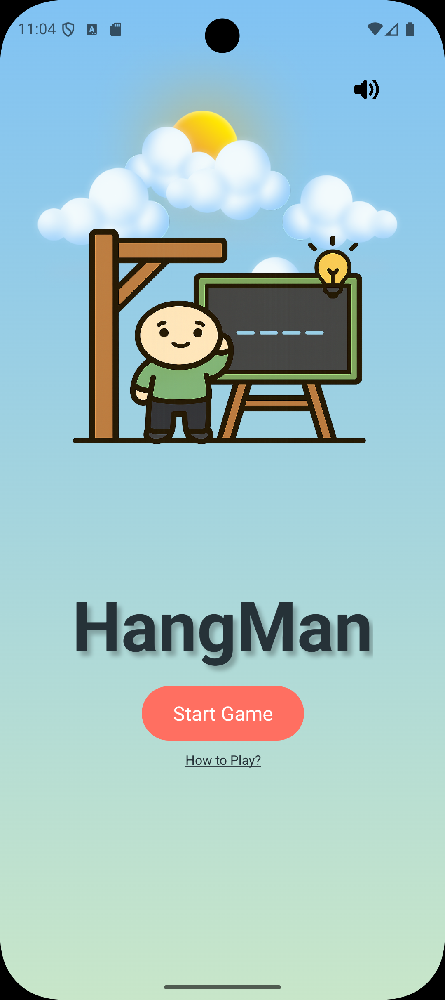
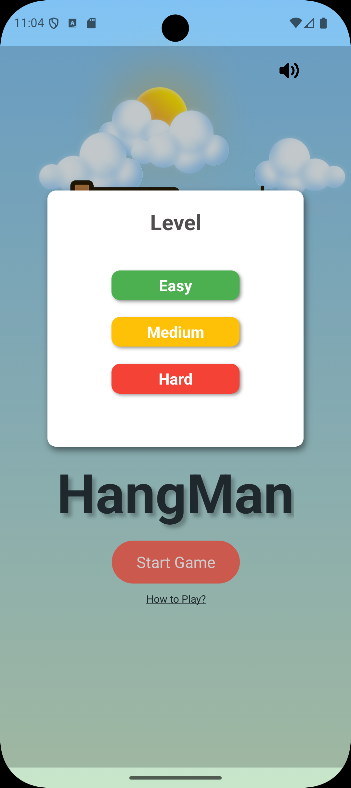
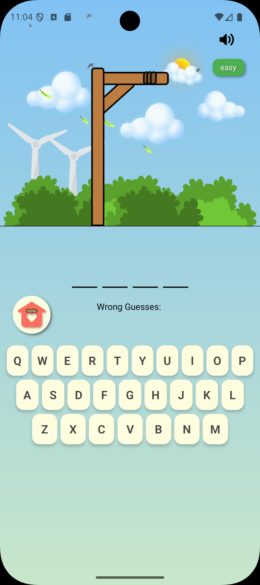
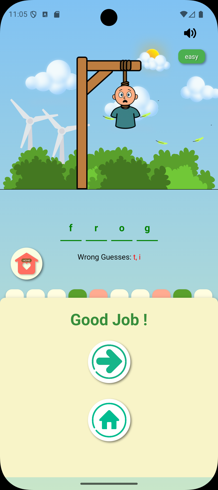
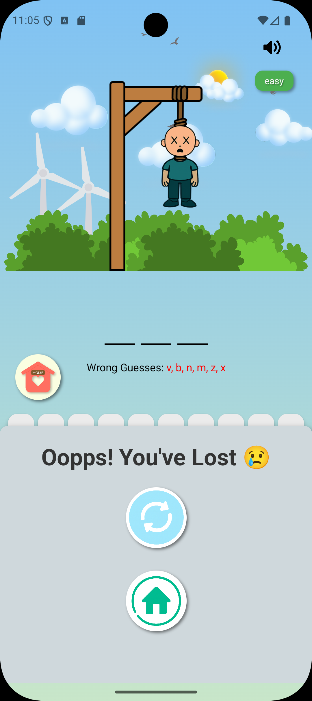

# 🎮 Hangman App

A playful, animated Hangman game built with React Native and Expo Router. Designed for mobile-first interaction, this app features level-based word challenges, celebratory animations, sound effects, and persistent progress tracking via Firebase and AsyncStorage.

---

## 📚 Table of Contents

```bash
- [🚀 Features](#-features)
- [🛠️ Tech Stack](#️-tech-stack)
- [📦 Installation](#-installation)
- [📁 Project Structure](#-project-structure)
- [📸 Screenshots](#-screenshots)
- [📱 Download the App](#-download-the-app)
- [🎬 Demo](#-demo)
- [🧩 Want to Contribute?](#-want-to-contribute)
- [🔐 Environment Setup](#-environment-setup)
- [🧪 Testing](#-testing)
- [📱 Supported Platforms](#-supported-platforms)
- [🧩 Customization](#-customization)
- [📝 License](#-license)
- [🙌 Acknowledgments](#-acknowledgments)
- [✨ Author](#-author)
```

---

## 🚀 Features

```bash
- 🔤 Level Selection: Choose between Easy, Medium, and Hard word lists.
- 🔊 Sound Effects: Button clicks, win/loss feedback, and looping background audio.
- 🎉 Lottie Animations: Confetti bursts and trophy animations for milestone achievements.
- 🧠 Progress Tracking: Solved words are stored locally and synced with Firebase.
- 🧩 Custom UI Components: Cloud overlays, animated buttons, and modal transitions.
- 📦 Modular Codebase: Clean structure with reusable logic and scalable configuration.
```

---

## 🛠️ Tech Stack

| Technology          | Purpose                                |
| ------------------- | -------------------------------------- |
| Expo + React Native | Core mobile framework                  |
| Expo Router         | Navigation and routing                 |
| Firebase Firestore  | Word list storage and retrieval        |
| AsyncStorage        | Local solved word tracking             |
| Lottie              | Animated feedback and celebration      |
| Toast Message       | In-app notifications and alerts        |
| Expo Audio          | Sound playback (migrated from expo-av) |

---

## 📦 Installation

```bash

git clone https://github.com/FouzEf/hangman-app/tree/main
cd hangman-app
npm install
npx expo start

Make sure you have Expo CLI installed: npm install -g expo-cli
```

## 📁 Project Structure

```bash
hangman-app/
├── app/                  # Screens and routes
├── assets/               # Images and sound files
├── components/           # Reusable UI components
├── audio/                # Sound hooks and utilities
├── utils/                # Storage and logic helpers
├── FIreStore.js          # Firebase word fetching
├── scripts/              # Project maintenance scripts
├── package.json
└── README.md
```

## 📸 Screenshots

<h3>🏠 Home Screen</h3>


<h3>🎯 Level Selection</h3>


<h3>🕹️ Game Screen</h3>


<h3>✅ Correct Word</h3>


<h3>❌ Wrong Word</h3>


<h3>🏆 Win Level</h3>


---

## 📱 Download the App

| Platform | Link                                                                                |
| -------- | ----------------------------------------------------------------------------------- |
| Android  | [Play Store](https://play.google.com/store/apps/details?id=com.yourname.hangmanapp) |

| Web Demo | [Live Preview](https://hangman-app.vercel.app) |

> Replace the links with your actual app store URLs or deployment links.

---

## 🎬 Demo

```bash
Watch a quick walkthrough of gameplay, animations, and level progression:

[▶️ YouTube Demo](https://www.youtube.com/watch?v=your-demo-video-id)
```

---

## 🧩 Want to Contribute?

Feel free to fork the repo, submit pull requests, or open issues for bugs and feature suggestions. Contributions are welcome!

## 🔐 Environment Setup

```bash
Create a .env file for Firebase configuration:
FIREBASE_API_KEY=your_api_key
FIREBASE_PROJECT_ID=your_project_id
```

## 🧪 Testing

```bash
Lint your code with:
npm run lint
```

## 📱 Supported Platforms

```bash
- Android
- Web (limited support)
```

## 🧩 Customization

```bash
You can easily extend the game by:
- Adding new word categories in Firestore
- Customizing level colors and animations
- Integrating multiplayer or timed modes
```

## 📝 License

```bash
This project is licensed under the MIT License. See the LICENSE file for details.
```

## 🙌 Acknowledgments

```bash
- Expo
- React Native
- LottieFiles
- Firebase
- react-native-toast-message
```

## ✨ Author

```bash
Fouziya Ashik and
estafania details
```
