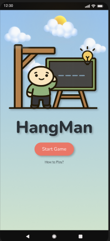

# Hangman Game App 👨🪢

This is an [Expo](https://expo.dev) project created with [`create-expo-app`](https://www.npmjs.com/package/create-expo-app).

## How we built it

This application is pair-coded by @fouz0062 and @esteficodes.
It was built using **TypeScript** and **React Native** with Expo.

## Teck Stack

- **React Native** (with Expo) for the mobile app
- **TypeScript** for type safety and maintainable code
- **Figma** for prototyping and design

# Screenshots

---

## Home screen



---

## How to run it

1. Install dependencies

   ```bash
   npm install
   ```

2. Start the app

   ```bash
   npx expo start
   ```

3. Run on your device or emulator

Press i to open on iOS Simulator (Mac only).

Press a to open on Android Emulator.

Or scan the QR code with the Expo Go app on your device.

```


## How to play

```
